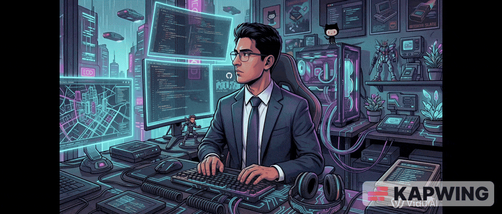

# Hey, I'm Rodrigo Bautista  Nice to Meet You! 

###

  

###

  
  </a>
  

<h2 align="center">About Me</h2>

###
- 🎓 Bachelor's degree in Applied Mathematics and Computer Science with a strong passion for Data Science, Machine Learning, Deep Learning, MLOps, and Web Development.

- ⚙️ Strong focus on **Data Science, creating Machine Learning algorithms for problem-solving.**
- 🧠 Knowledge of machine learning algorithms for decision-making.

- 🔍 Interested in **creating applications based on Machine Learning models for innovation and automation in any sector.**

- 💡 I enjoy creating workflows to transform and extract value from data, thereby strengthening data understanding. I love learning about and building machine learning systems.

- 💻 I am constantly seeking out and learning about new technologies.

- 🌟 In my free time, I enjoy exploring various media and finding new sources of inspiration for my projects.
###

<h2 align="center">My Stats</h2>

###

  

###

<h2 align="center">Techs I Use</h2>

###

  
  

  <!-- 
   -->
  
  
  
  
  
  

  
  
  <!--  -->
  <!--  -->
  <!--  -->
  <!--  -->
  
  <!--  -->
  
  
  
  
  

